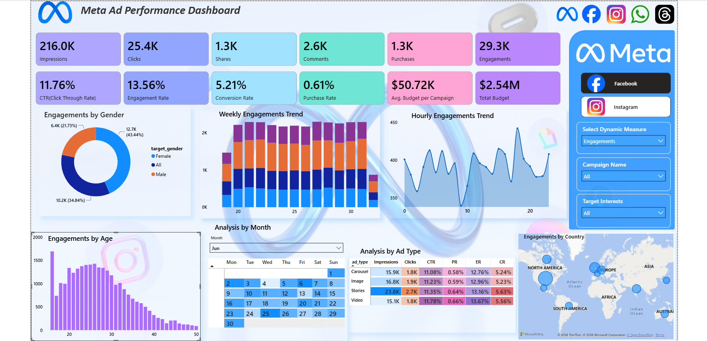

# 📊 Meta Ad Performance Analysis Dashboard

> An interactive Power BI dashboard that analyzes Meta (Facebook & Instagram) advertising campaigns to help marketing teams optimize campaign performance, improve conversions, and make data-driven budgeting decisions.

---

# 📌 Project Overview

Digital marketers spend a significant portion of their budget on Meta advertising, but many campaigns generate high engagement without producing enough conversions.

This project was developed to answer key business questions such as:
- Which campaigns perform best?
- Which audience should be targeted?
- Which ad format delivers the highest ROI?
- When should advertisements be shown?
- Which countries deserve more marketing investment?

Using Power BI, I transformed raw advertising data into an interactive dashboard that enables stakeholders to monitor campaign performance and make strategic marketing decisions. 
The dashboard aligns with the business objective of tracking campaign reach, engagement, conversions, and budget utilization for Facebook and Instagram paid campaigns.
---

# 🎯 Business Objective

Marketing teams often face challenges such as:

- Spending large advertising budgets without understanding campaign effectiveness.
- Identifying the right customer segments.
- Measuring the complete customer journey from impressions to purchases.
- Optimizing campaign budgets across different ad formats and regions.

The goal of this project was to build a centralized dashboard that provides actionable insights into campaign performance and supports data-driven optimization.
---

# 🛠 Tools & Technologies

- Power BI
- Power Query
- DAX
- Data Modeling
- Microsoft Excel
- CSV Dataset

---

# 📈 KPI

| KPI | Value | Business Meaning |
|------|-------|------------------|
| Impressions | **216,000** | Total number of times advertisements were displayed |
| Clicks | **25,400** | Total users who clicked advertisements |
| Engagements | **29,000** | Total interactions (Clicks + Shares + Comments) |
| Purchases | **1,300** | Successful customer conversions |
| Click Through Rate (CTR) | **11.76%** | Percentage of impressions converted into clicks |
| Engagement Rate | **13.56%** | Percentage of impressions resulting in engagement |
| Conversion Rate | **5.21%** | Percentage of clicks converted into purchases |
| Purchase Rate | **0.61%** | Percentage of impressions resulting in purchases |
| Total Budget | **2.5 Million** | Total advertising budget |
| Average Campaign Budget | **50,700** | Average budget allocated per campaign |

---
# 📊 Dashboard Preview

---

## 1️⃣ KPI Performance Analysis

### Observations

- Total Impressions reached **216K**, demonstrating excellent campaign reach.
- Users generated **25.4K clicks**, indicating strong advertisement relevance.
- Campaigns received **29K total engagements**.
- Total purchases reached **1.3K**.
- Total advertising budget was **2.5 Million**.

### Business Insight

The campaigns successfully capture user attention.

High impressions combined with high CTR demonstrate that the creatives, audience targeting, and campaign messaging are highly effective.

The primary challenge lies in converting interested users into paying customers.

---

## 2️⃣ Executive Summary
The dashboard tells the story of the entire customer acquisition funnel.

At the top of the funnel,the campaigns generated 216,000 impressions and 25,400 clicks, resulting in an impressive 11.76% Click-Through Rate. 
This indicates that the ad creatives and audience targeting successfully attracted user attention.

However, only 1,300 purchases were recorded, resulting in a 5.21% conversion rate from clicks and a 0.61% purchase rate from impressions.

This reveals a major drop-off between engagement and purchase, suggesting that while the campaigns are effective at driving awareness, 
there are opportunities to improve the lower stages of the conversion funnel.

---

## 3️⃣ Audience Analysis

### Gender Performance

| Gender | Engagement | Share |
|----------|-----------|--------|
| Female | **13K** | **43%** |
| Other | **10K** | **35%** |
| Male | **6K** | **22%** |

### Key Insight

- Female audiences contributed 43% of total engagement.
- Male users contributed 22%.
- Others users contributed 35%.

---

## 4️⃣ Age Group Analysis

### Key Findings

Highest engagement comes from users between:

**20–30 Years**

Engagement decreases considerably after the age of **35**.

### Business Insight

Young adults are significantly more responsive to Meta advertising.

Marketing budgets should focus primarily on audiences aged **18–30**, as this demographic provides the strongest engagement potential.

---

## 5️⃣ Geographic Analysis

Top Performing Countries

- 🇮🇳 India
- 🇺🇸 United States
- 🇧🇷 Brazil
- 🇩🇪 Germany
- 🇬🇧 United Kingdom

### Business Insight

India and the United States generate high engagement volumes.

Germany and the United Kingdom represent valuable markets with stronger purchasing potential.

A region-specific campaign strategy can improve advertising ROI.

---

## 6️⃣ Time Analysis

### Weekly Trend

Campaign engagement remains relatively stable throughout the month, indicating consistent advertisement performance.

### Hourly Trend

Peak engagement occurs between:

**3 PM – 8 PM**

Lowest activity occurs between:

**12 AM – 5 AM**

### Business Insight

Campaign scheduling should prioritize afternoon and evening hours to maximize audience interaction.

---

## 7️⃣ Calendar Analysis

The calendar heat-map identifies increased engagement during:

- 19th–21st
- 25th–27th

### key Insight
- Event-driven campaigns appear to generate stronger engagement than regular campaigns.

---

## 8️⃣ Ad Format Performance

| Ad Type | Impressions | Clicks | CTR | Conversion Rate | Engagement Rate |
|----------|------------|---------|------|-----------------|----------------|
| Carousel | 48K | 6K | 11.7% | 5.1% | 13.4% |
| Image | 51K | 6K | 11.7% | 4.9% | 13.5% |
| Stories | 72K | 8K | 11.8% | 5.2% | 13.6% |
| Video | 46K | 5K | **11.9%** | **5.2%** | **13.7%** |

### Key Findings 

- Video advertisements deliver the highest overall performance across CTR, Engagement Rate, and Conversion Rate.
- Stories generate the largest reach and also perform exceptionally well.
- Carousel and Image advertisements maintain stable performance but contribute fewer conversions.
- Future advertising budgets should prioritize Video and Stories campaigns.

---

# 💡 Key Business Insights

- Campaigns generated **216K impressions**, indicating excellent market reach.
- **11.76% CTR** significantly exceeds the typical industry benchmark, demonstrating highly effective creatives and targeting.
- User engagement remains strong with **29K total engagements**.
- Female users account for **43%** of engagement, making them the most responsive audience.
- The **20–30 age group** is the highest-performing demographic.
- India and the United States contribute the highest engagement volumes.
- Video advertisements achieve the strongest overall campaign performance.
- Afternoon and evening campaigns consistently generate higher engagement.
- Despite strong awareness, only **0.61%** of impressions convert into purchases, highlighting a major opportunity for conversion optimization.

---
